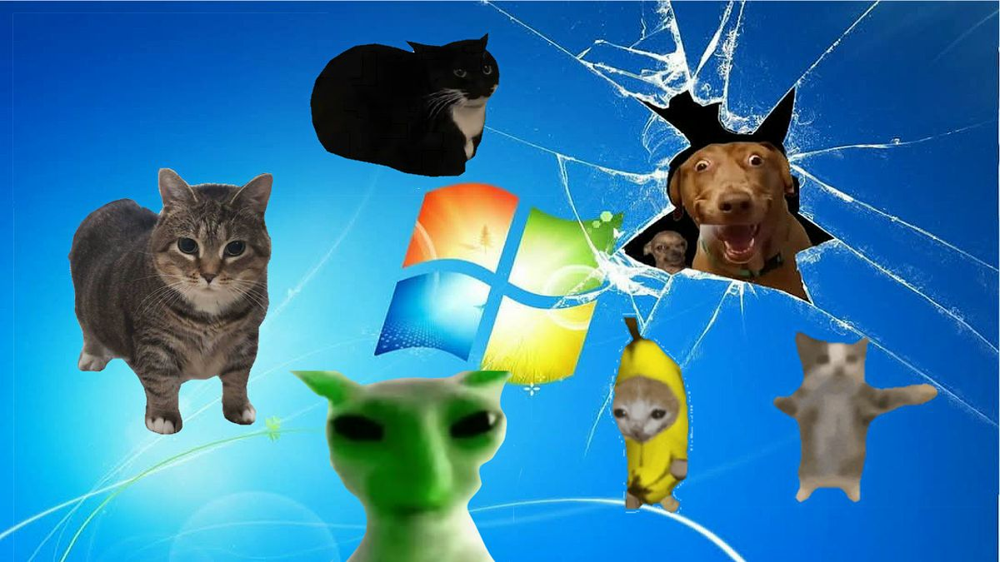

  

# 🎯 Portfolio OnePager  

Responsive one-page portfolio with minimal JS and clean sections. 🚀  

⚠️ **Note:** This project is currently about **60% complete** — still a work in progress! 🛠️  

- Sections: Profile, About, Skills, Projects, Contact  
- Responsive: desktop nav + hamburger menu on mobile  
- Files: `index.html`, `style.css`, `mediaqueries.css`, `script.js`, `assets/`  

## ▶️ Run  
- Open https://resume-qxd7.vercel.app/  

## 🛠️ Customize  
- Update text/links in `index.html`  
- Swap images and `RESUME-Aaron.pdf` in `assets/`  
- Adjust styles/breakpoints in CSS  

## 🚀 Deploy  
- Host on GitHub Pages, Netlify, or Vercel  
